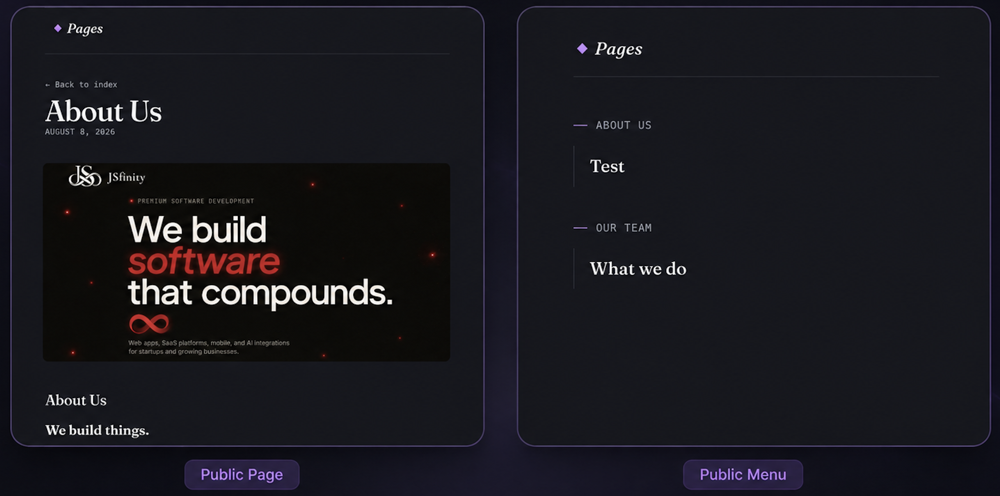
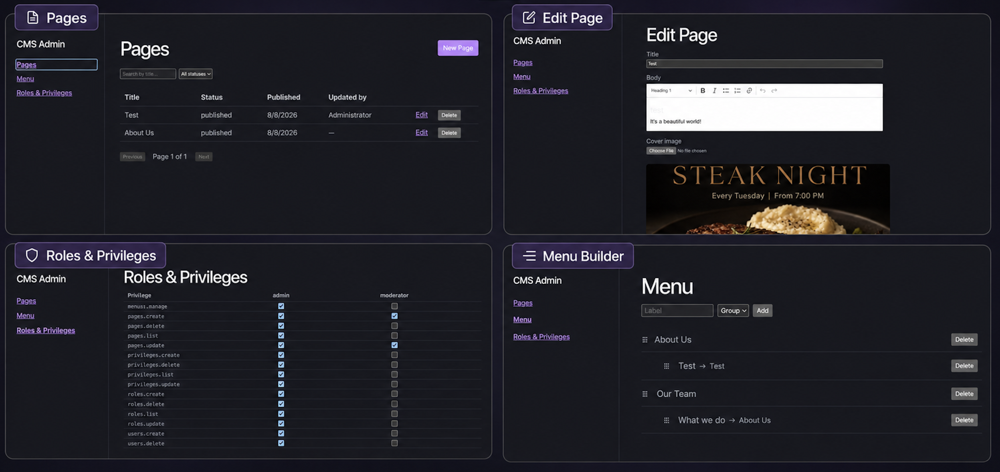
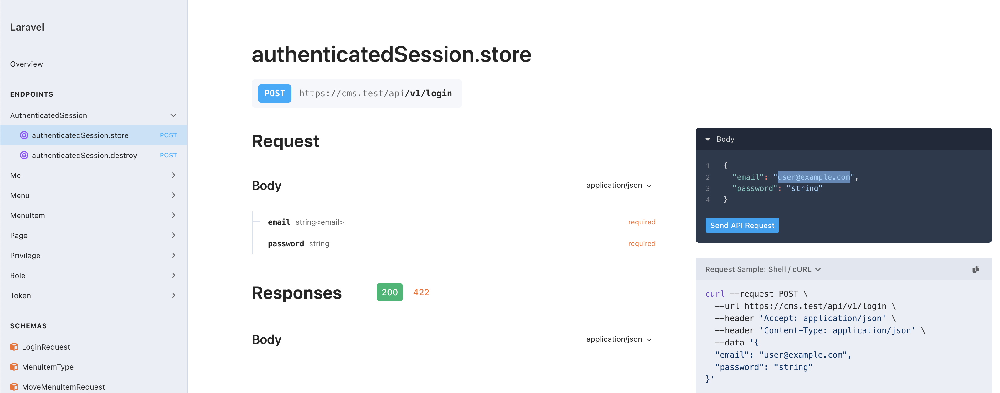

# CMS

A small CMS Laravel API backend + React frontend.

## Preview

| Public site | Admin panel | API docs |
|---|---|---|
|  |  |  |

## Tooling

Laravel best practices are enforced via my own package **[SEATBELT](https://github.com/Hashane/Seatbelt)** ⚠️

## Project layout

```
backend/    Laravel API
frontend/   React app (public site + admin panel)
```

Flutter app (consumes the public API): [Hashane/cms-app](https://github.com/Hashane/cms-app)

## Backend setup

```
cd backend
composer install
cp .env.example .env
php artisan key:generate
```

Create a database and point `.env` at it:

```
DB_CONNECTION=mysql
DB_HOST=127.0.0.1
DB_PORT=3306
DB_DATABASE=cms
DB_USERNAME=root
DB_PASSWORD=
```

Then:

```
php artisan migrate --seed
php artisan storage:link
php artisan serve
```

The API is now running at `http://localhost:8000` (or whatever `APP_URL` you set).

## Frontend setup

```
cd frontend
cp .env.example .env
pnpm install
pnpm dev
```

`vite.config.ts` proxies `/api` and `/sanctum` to the backend. Check the `target` matches wherever your backend is running.

The frontend is now live at `http://localhost:5173`.

## Seeded accounts

| Role      | Email             | Password     |
| --------- | ----------------- | ------------ |
| Admin     | admin@cms.com     | Password123! |
| Moderator | moderator@cms.com | Password123! |

Admin can manage pages, the menu, roles and privileges. Moderator can list/create/update pages only, no delete.

## Artisan command 

```
php artisan pages:publish-due
``` 

## API docs

With the backend running, open:

```
http://localhost:8000/docs/api
```

Generated straight from the routes/FormRequests, no hand-written annotations to keep in sync.

The same document is also available as raw OpenAPI JSON, useful for importing into Postman/Insomnia or generating a client:

```
http://localhost:8000/docs/api.json
```

## Running tests

Backend:

```
cd backend
php artisan test
```

Code style:

```
./vendor/bin/pint --test
```

Frontend lint/build:

```
cd frontend
pnpm lint
pnpm build
```

## Notes

Authorization uses `spatie/laravel-permission`. Policies check `$user->can('pages.delete')`, not role names. Admin has every permission, Moderator has `pages.list` / `pages.create` / `pages.update`.

Page visibility (`Page::publishedAndDue()`) is a query scope, checked on every page fetch. A page goes live the moment its `published_at` passes, no cron needed.

Every page tracks who created and last updated it (`created_by` / `updated_by`), stamped automatically by `PageObserver`. Deletes are soft, with an admin restore endpoint.
